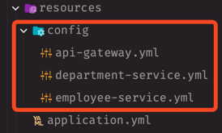

> 유레카 서버에 등록된 다른 프로젝트의 설정 파일을 관리한다.

다른 프로젝트에 설정한 application.name 과 동일한 yaml 파일을 만들어야한다.



그리고 다른 프로젝트에는 다음과 같은 설정이 필요하다. `spring.config.import` 옵션 값이 중요하다.

```yaml
# spring cloud gateway
spring:
  application:
    name: api-gateway
  config:
    import: "optional:configserver:http://localhost:8088"
```

```yaml
# department service
spring:
  application:
    name: department-service
  config:
    import: "optional:configserver:http://localhost:8088"
```

```yaml
# employee service
spring:
  application:
    name: employee-service
  config:
    import: "optional:configserver:http://localhost:8088"

```

`config-server` 에 **8088** 포트가 할당되어 있다. `@EnableConfigServer` 어노테이션에 의해서 `resources/config/서비스이름.yml` 값을 읽어들이는 것으로 생각된다.
